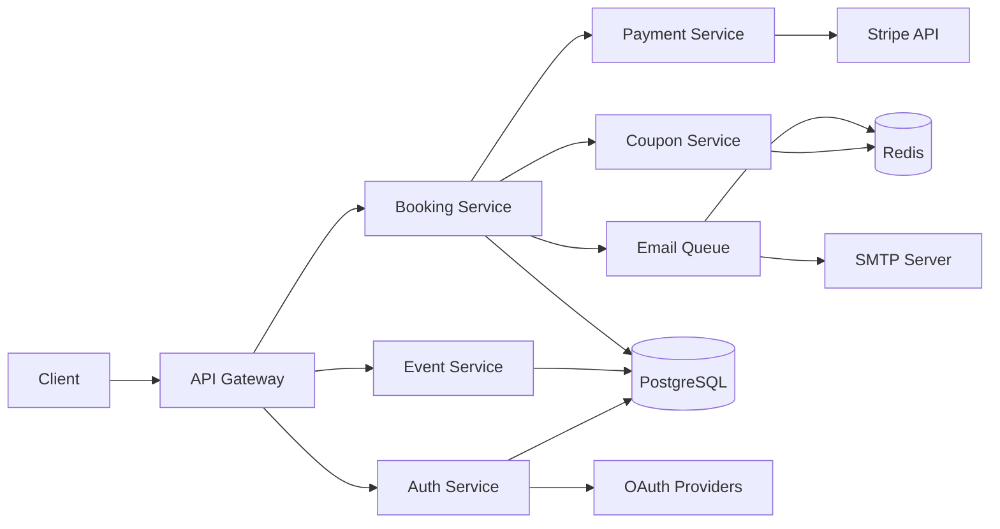
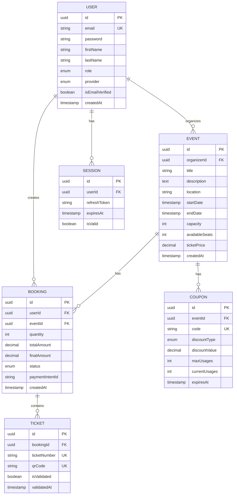

# System Architecture

## Overview

This document describes the architecture of the Event Management Platform, including system design decisions, patterns used, and scalability considerations.

---

## Table of Contents

- [Executive Summary](#Executive-Summary)
- [High-Level Architecture](#high-level-architecture)
- [Domain Logic & Patterns](#domain-logic-and-patterns)
- [Data Architecture](#data-architecture)
- [API Design](#api-design)
- [Security & Reliability](#security-and-reliability)
- [Scalability & Performance](#scalability--performance)
- [Deployment Architecture](#deployment-architecture)
- [Monitoring & Observability](#monitoring--observability)

---

## Executive Summary
This platform is built as a **Type-Safe Monorepo**, utilizing a "Contract-First" approach to ensure data synchronization between the React frontend and NestJS backend. The architecture is designed to solve the three primary challenges of event platforms: **concurrency (over-booking), consistency (payment-to-ticket integrity), and developer velocity**.

### Architectural Decision Records (ADR)
| Decision | Choice | Justification |
| :--- | :--- | :--- |
| **Consistency Model** | Strong Consistency (CP) | Through the lens of CAP Theorem, we prioritize consistency for the Booking module to prevent over-selling. We utilize PostgreSQL **Pessimistic Locking** during checkouts for consistency. |
| **Type Strategy** | Shared Zod Contract | To eliminate type mismatch, we use a shared package as the single source of truth for DTOs and validation, reducing integration errors. |
| **System Boundary** | Modular Monolith | Chosen to reduce network latency and deployment complexity during initial scaling, while maintaining strict domain boundaries for an ease of future Microservices migration. |

---

## High-Level Architecture

### The Monorepo Ecosystem
The project is structured to enforce a "One-Way Dependency Flow."

* **Apps Layer:** Contains the React (Vite) frontend and NestJS API.
* **Packages Layer:** Contains the `@event-mgmt/contract` (Zod schemas), `@event-mgmt/ui` (Shared components), and shared configurations.
* **Boundary Enforcement:** We use workspace linting rules to ensure the UI or API never imports directly from each other, only from shared packages.

### System Overview

```
┌─────────────────────────────────────────────────────────────────┐
│                          Client Layer                           │
│  ┌──────────────┐  ┌──────────────┐  ┌──────────────┐           │
│  │ Web Browser  │  │ Mobile App   │  │  Admin UI    │           │
│  │  (React)     │  │ (Future)     │  │  (Future)    │           │
│  └──────────────┘  └──────────────┘  └──────────────┘           │
└─────────────────────────────────────────────────────────────────┘
                              │
                              │ HTTPS / WSS
                              ▼
┌─────────────────────────────────────────────────────────────────┐
│                      Application Layer                          │
│  ┌────────────────────────────────────────────────────────────┐ │
│  │              NestJS Application Server                     │ │
│  │  ┌──────────┐ ┌──────────┐ ┌──────────┐ ┌──────────┐       │ │
│  │  │   Auth   │ │  Events  │ │ Bookings │ │ Payment  │       │ │
│  │  │  Module  │ │  Module  │ │  Module  │ │  Module  │       │ │
│  │  └──────────┘ └──────────┘ └──────────┘ └──────────┘       │ │
│  │  ┌──────────┐ ┌──────────┐ ┌──────────┐                    │ │
│  │  │  Coupons │ │  Tickets │ │   Email  │                    │ │
│  │  │  Module  │ │  Module  │ │  Module  │                    │ │
│  │  └──────────┘ └──────────┘ └──────────┘                    │ │
│  └────────────────────────────────────────────────────────────┘ │
└─────────────────────────────────────────────────────────────────┘
                              │
                              ▼
┌─────────────────────────────────────────────────────────────────┐
│                        Data Layer                               │
│  ┌──────────────┐  ┌──────────────┐  ┌──────────────┐           │
│  │ PostgreSQL   │  │    Redis     │  │  File Store  │           │
│  │  (Primary    │  │ (Cache/Queue)│  │   (Future)   │           │
│  │   Database)  │  │              │  │              │           │
│  └──────────────┘  └──────────────┘  └──────────────┘           │
└─────────────────────────────────────────────────────────────────┘
                              │
                              ▼
┌─────────────────────────────────────────────────────────────────┐
│                    External Services                            │
│  ┌──────────────┐  ┌──────────────┐  ┌──────────────┐           │
│  │   Stripe     │  │    OAuth     │  │     SMTP     │           │
│  │   (Payment)  │  │  (Google/    │  │    (Email)   │           │
│  │              │  │   GitHub)    │  │              │           │
│  └──────────────┘  └──────────────┘  └──────────────┘           │
└─────────────────────────────────────────────────────────────────┘
```

### Component Interaction



---

## Domain Logic & Patterns

### 1. Contract-First Development (Zod)
Unlike standard implementations where validation is an afterthought, our architecture uses **Shared Zod Schemas** as the "source of truth."
* **Backend:** Schemas are used by NestJS `ValidationPipe` for incoming request parsing.
* **Frontend:** The same schemas generate TypeScript types via `z.infer<T>` for API client responses and form validation.

### 2. Concurrency & Race Condition Management
To handle "hot" event drops (concerts/festivals), we move beyond simple CRUD:
* **Pessimistic Locking:** In the Booking Service, we use `SELECT FOR UPDATE` on the Event row to lock available seat counts during the transaction window.
* **Atomic Updates:** We use raw SQL increments/decrements to avoid "lost update" anomalies common in standard ORM save patterns.

### 3. Resilience: Circuit Breaker Pattern
To prevent cascading failures when external services (Stripe/SMTP) are degraded:
* **Implementation:** If the Stripe API latency exceeds 5s or fails 5 consecutive times, the circuit opens.
* **Result:** The system immediately returns a "Payment Gateway Temporarily Unavailable" response, preserving server thread pools for other system functions.

---

## Data Architecture

### Entity Relationship & Normalization
The database is designed with high-read optimization in mind, utilizing PostgreSQL.

### Indexing & Performance Strategy
* **Connection Pooling:** Configured via `pg-pool` to handle 1,000+ concurrent requests with an idle timeout of 30s to prevent resource exhaustion.
* **Caching:** Redis is utilized as a **Cache-Aside** layer for event metadata (TTL: 300s) to reduce primary DB load during peak traffic.

**Primary Indexes:**
- All primary keys (UUID)
- Unique constraints (email, ticket QR codes)

**Secondary Indexes:**
- `users.email` - Fast login lookups
- `events.startDate` - Event list queries
- `events.organizerId` - Organizer's events
- `bookings.userId` - User's bookings
- `tickets.qrCode` - Validation lookups

**Composite Indexes:**
- `(eventId, status)` - Event bookings by status to optimize real-time seat-count calculations.
- `(userId, createdAt)` - User's recent bookings

**Query Optimization:**
- Indexed columns for WHERE/JOIN
- Pagination for large result sets
- Select only needed columns
- Avoid N+1 queries (eager loading)

### Entity Relationship Diagram



---

### Request/Response Format

**Request:**
```http
POST /bookings HTTP/1.1
Authorization: Bearer <token>
Content-Type: application/json
X-Correlation-ID: req-123

{
  "eventId": "uuid",
  "quantity": 2,
  "couponCode": "SAVE20"
}
```

**Response:**
```json
{
  "success": true,
  "data": {
    "id": "uuid",
    "status": "PENDING",
    "totalAmount": 100.00,
    "finalAmount": 80.00
  },
  "correlationId": "req-123",
  "timestamp": "2025-01-09T10:00:00Z"
}
```

---
## Security & Reliability

### Authentication & Session Security
* **JWT Rotation:** Implementation of short-lived Access Tokens (15m) and Refresh Tokens (7d) stored in an HTTP-only cookie to mitigate XSS.
* **Refresh Token Rotation:** Every time a refresh token is used, a new one is issued, and the old one is invalidated in Redis to prevent replay attacks.

### Observability

* **Correlation IDs:** A unique ID is generated for every request and propagated through logs and external service calls, allowing for distributed tracing.

* **Structured Logging:** Logs are emitted in JSON format, ready for ingestion into ELK/Datadog for real-time monitoring:
```json
{
  "level": "info",
  "timestamp": "2025-01-09T10:00:00Z",
  "correlationId": "req-123",
  "userId": "user-456",
  "method": "POST",
  "url": "/bookings",
  "statusCode": 201,
  "duration": 234,
  "message": "Booking created successfully"
}
```

### JWT Token Structure

**Access Token Payload:**
```json
{
  "sub": "user-id",
  "email": "user@example.com",
  "role": "CUSTOMER",
  "sessionId": "session-id",
  "iat": 1704801600,
  "exp": 1704802500
}
```

**Refresh Token Payload:**
```json
{
  "sub": "user-id",
  "sessionId": "session-id",
  "iat": 1704801600,
  "exp": 1705406400
}
```

### Security Measures

1. **Password Security**
   - bcrypt hashing (12 rounds)
   - Password strength validation
   - No plaintext storage

2. **Token Security**
   - Short-lived access tokens (15min)
   - Refresh token rotation
   - Session invalidation on logout

3. **API Security**
   - CORS configuration
   - Helmet middleware (security headers)
   - Input validation (Zod schemas)
   - SQL injection prevention (parameterized queries)

4. **Rate Limiting**
   - Per-IP limits
   - Per-user limits
   - Sliding window algorithm

---

## Scalability & Performance

### Vertical Partitioning
- Separate read replicas
- Master for writes, replicas for reads

### Horizontal Scaling
The API is **Stateless**. No local file storage or in-memory sessions are used.
* **Load Balancing:** Nginx/Ingress distributes traffic across $N$ replicas.
* **Auto-scaling:** Pods are scaled via Kubernetes HPA based on a 70% CPU threshold.

```
                    Load Balancer
                          │
        ┌─────────────────┼─────────────────┐
        ▼                 ▼                 ▼
    ┌────────┐       ┌────────┐       ┌────────┐
    │ API    │       │ API    │       │ API    │
    │ Server │       │ Server │       │ Server │
    │   #1   │       │   #2   │       │   #3   │
    └────────┘       └────────┘       └────────┘
        │                 │                 │
        └─────────────────┼─────────────────┘
                          ▼
              ┌──────────────────────┐
              │   PostgreSQL         │
              │   (Primary/Replica)  │
              └──────────────────────┘
```

### Caching Strategy

**Cache Layers:**

1. **Application Cache (Redis)**

2. **Database Query Cache**
   - TypeORM query caching
   - Materialized views for complex queries

3. **CDN Cache** (Future)
   - Static assets
   - Event images
---

## Deployment Architecture

### Kubernetes Architecture

```
┌─────────────────────────────────────────────────────────┐
│                     Kubernetes Cluster                  │
│                                                         │
│  ┌──────────────────────────────────────────────────┐   │
│  │              Ingress Controller                  │   │
│  │              (nginx-ingress)                     │   │
│  └───────────────────┬──────────────────────────────┘   │
│                      │                                  │
│       ┌──────────────┴──────────────┐                   │
│       ▼                              ▼                  │
│  ┌─────────┐                   ┌─────────┐              │
│  │ Backend │                   │Frontend │              │
│  │ Service │                   │ Service │              │
│  │  (3-10  │                   │  (2-5   │              │
│  │  pods)  │                   │  pods)  │              │
│  └─────────┘                   └─────────┘              │
│       │                                                 │
│       ▼                                                 │
│  ┌─────────┐    ┌─────────┐                             │
│  │Postgres │    │  Redis  │                             │
│  │StatefulSet    │  Pod    │                            │
│  └─────────┘    └─────────┘                             │
│                                                         │
└─────────────────────────────────────────────────────────┘
```

### Service Mesh (Future if needed)

```
┌─────────────────────────────────────────────────────┐
│               Service Mesh (Istio)                  │
│  ┌──────────┐  ┌──────────┐  ┌──────────┐           │
│  │  Sidecar │  │  Sidecar │  │  Sidecar │           │
│  │  Proxy   │  │  Proxy   │  │  Proxy   │           │
│  └────┬─────┘  └────┬─────┘  └────┬─────┘           │
│       │             │              │                │
│  ┌────▼─────┐  ┌───▼──────┐  ┌───▼──────┐           │
│  │  Auth    │  │  Events  │  │ Bookings │           │
│  │ Service  │  │  Service │  │  Service │           │
│  └──────────┘  └──────────┘  └──────────┘           │
└─────────────────────────────────────────────────────┘
```

**Benefits:**
- Traffic management
- Observability
- Security (mTLS)
- Resilience

### CI/CD Pipeline
* Github Actions with utilized **Turborepo Remote Caching**:
If the `@event-mgmt/contract` package is unchanged, the CI skips the build/test phases for dependent apps, reducing pipeline duration.

---

## Future Enhancements

### Microservices Evolution

**Current:** Modular monolith  
**Future:** Independent microservices

```
┌──────────┐  ┌──────────┐  ┌──────────┐
│  Auth    │  │  Events  │  │ Bookings │
│  Service │  │  Service │  │  Service │
└──────────┘  └──────────┘  └──────────┘
     │             │              │
     └─────────────┴──────────────┘
                   │
            ┌──────▼──────┐
            │   Message   │
            │     Bus     │
            │  (RabbitMQ) │
            └─────────────┘
```
---

## Conclusion

This architecture provides:
- ✅ Scalability through horizontal scaling
- ✅ Resilience through circuit breakers
- ✅ Security through multiple layers
- ✅ Observability through structured logging
- ✅ Maintainability through clean patterns

The system is designed to evolve from a modular monolith to microservices as needed, with clear boundaries and well-defined interfaces.