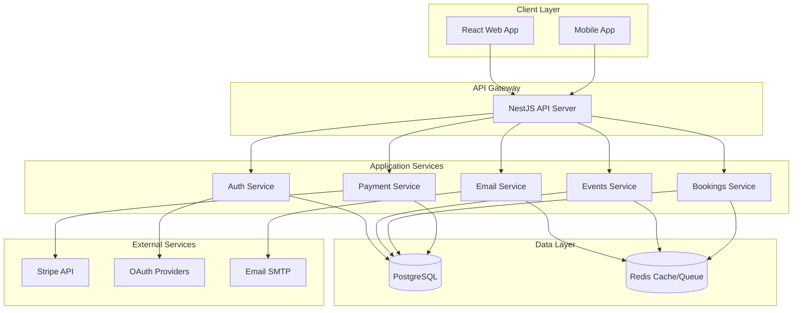

# Event Management Platform

> A production-grade, full-stack event management system built with React, NestJS, PostgreSQL, and Redis. Features real-time updates, secure authentication, payment processing, and comprehensive booking management.

[](https://www.typescriptlang.org/)
[](https://nestjs.com/)
[](https://reactjs.org/)
[](LICENSE)

## 📋 Table of Contents

- [Engineering Highlights](#engineering-highlights)
- [Key Features](#key-features)
- [Roadmap](#roadmap)
- [Architecture](#architecture)
- [Tech Stack](#tech-stack)
- [Getting Started](#getting-started)
- [Authentication & Authorization](#authentication--authorization)
- [Payment System](#payment-system)
- [Real-time Features](#real-time-features)
- [Deployment](#deployment)
- [Testing](#testing)

---

## 🛠 Engineering Highlights

### 1. Contract-First Architecture (E2E Type Safety)
To ensure 100% synchronization between the React frontend and NestJS backend, we utilize a shared workspace package (`@event-mgmt/contract`). 
* **Single Source of Truth:** Zod schemas define the API boundary.
* **Zero Type Drift:** Build-time validation ensures that changing a field in the backend immediately triggers compilation errors in the frontend.
* **Reduced Integration Overhead:** Standardizes DTOs across the entire stack.

### 2. High-Concurrency Integrity (Race Condition Mitigation)
Ticketing systems face unique challenges during "hot" event drops. This platform implements:
* **Pessimistic Locking:** Uses PostgreSQL `SELECT FOR UPDATE` to lock seat availability rows during the transaction window, ensuring zero over-selling.
* **Distributed Locking:** Redis-based locks for coupon redemptions to prevent multiple users from exhausting a single-use code simultaneously.

### 3. Service Resilience & Observability
* **Circuit Breaker Pattern:** Protects the core API from cascading failures by monitoring Stripe and SMTP health; opens the circuit if external latency exceeds 5s.
* **Distributed Tracing:** Implements Correlation IDs propagated via NestJS Interceptors for unified logging across the request lifecycle.
* **Horizontal Scalability:** Stateless design optimized for Kubernetes HPA, utilizing Redis for shared session/queue state.

---

## ✨ Key Features

### User Management & Authentication
- 🔐 **JWT Authentication** with access and refresh tokens
- 🌐 **OAuth 2.0 Integration** (Google, GitHub, Facebook)
- 👥 **Role-Based Access Control** (Admin, Organizer, Customer)
- ✉️ **Email Verification** and password reset flows
- 🔄 **Session Management** with device tracking

### Event Management
- 📅 **CRUD Operations** for events with rich details
- 🎫 **Dynamic Pricing** and capacity management
- 📊 **Real-time Seat Availability** via WebSockets
- 🏷️ **Coupon System** with percentage and fixed discounts
- 🔒 **Race Condition Prevention** using distributed locks

### Booking & Ticketing
- 🎟️ **QR Code Generation** for each ticket
- 💳 **Payment Processing** (Stripe integration + mock mode)
- 📧 **Email Confirmations** with ticket details
- 🔍 **Ticket Validation** system for entry
- 📱 **Booking Management** (view, cancel, refund)

### Technical Features
- ⚡ **Real-time Updates** with WebSocket
- 🔄 **Circuit Breaker Pattern** for service resilience
- 📬 **Message Queue** (Bull + Redis) for async operations
- 🎯 **Correlation IDs** for distributed tracing
- 🏥 **Health Checks** for monitoring
- 🐳 **Docker & Kubernetes** ready

---

## 🗺️ Roadmap
- [X] Complete application architecture & Design documentation
- [X] Complete application cloud architecture (AWS) & documentation 
- [X] Complete initial (alpha) k8s & terraform template
- [X] Ensure code quality and readability
- [X] Ensure major workflows functionality (Auth & Event listing and creation & Booking)
- [ ] Ensure secondary workflows functionality
- [ ] Flesh out API documentation & finalize dependency-cruiser
- [ ] Complete dockerization support
- [ ] Better test coverage & CI/CD

---

## 🏗️ Architecture

### System Architecture



### Monorepo Structure

```
event-management-monorepo/
├── apps/
│   ├── backend/           # NestJS API
│   └── frontend/          # React SPA
├── packages/
│   └── shared-schemas/    # Shared Zod schemas
└── k8s/                   # Kubernetes manifests
```

---

## 🛠️ Tech Stack

### Frontend
- **React 18** - UI library
- **Redux Toolkit** - State management
- **React Router** - Navigation
- **TailwindCSS** - Styling
- **Stripe Elements** - Payment UI
- **Socket.io Client** - Real-time updates
- **Axios** - HTTP client

### Backend
- **NestJS 10** - Node.js framework
- **TypeORM** - ORM for PostgreSQL
- **PostgreSQL 15** - Primary database
- **Redis 7** - Caching & message queue
- **Bull** - Queue management
- **Passport.js** - Authentication
- **Stripe SDK** - Payment processing
- **Socket.io** - WebSocket server
- **Zod** - Schema validation

### DevOps & Tools
- **Turborepo** - Monorepo management
- **Docker** - Containerization
- **Kubernetes** - Orchestration
- **GitHub Actions** - CI/CD
- **pnpm** - Package manager
- **TypeScript** - Type safety
- **ESLint & Prettier** - Code quality

---

## 🚀 Getting Started

### Prerequisites

```bash
# Required
- Node.js 20+ 
- Docker & Docker Compose
- PostgreSQL 15
- Redis 7

# Optional (for production features)
- Stripe account
- OAuth provider credentials
- SMTP server
```

### Quick Start (5 minutes)

#### 1. Clone the Repository

```bash
git clone https://github.com/yourusername/event-management.git
cd event-management
```

#### 2. Install Dependencies

```bash
npm install
```

#### 3. Configure Environment

```bash
# Backend
cp apps/backend/.env.example apps/backend/.env

# Frontend  
cp apps/frontend/.env.example apps/frontend/.env
```

**Minimum required configuration** (apps/backend/.env):
```env
# Database
DB_HOST=localhost
DB_PORT=5432
DB_USERNAME=postgres
DB_PASSWORD=postgres
DB_NAME=event_management

# Redis
REDIS_HOST=localhost
REDIS_PORT=6379

# JWT Secrets (use strong random strings in production)
JWT_ACCESS_SECRET=your-super-secret-access-key
JWT_REFRESH_SECRET=your-super-secret-refresh-key

# Feature Flags (mock mode - no external services needed)
FEATURE_PAYMENT_ENABLED=false
FEATURE_EMAIL_ENABLED=false
```

#### 4. Start Development Servers

```bash
npm run dev
```

#### 5. Access the Application

- **Frontend:** http://localhost:5173
- **Backend API:** http://localhost:4000

### Seed Demo Data (Optional)

```bash
npm run seed:demo
```

This creates:
- Admin user: `admin@demo.com` / `Admin123!`
- Organizer user: `organizer@demo.com` / `Organizer123!`
- Customer user: `customer@demo.com` / `Customer123!`
- Sample events

---

### Core Endpoints

#### Authentication

```http
POST   /auth/register              # Register new user
POST   /auth/login                 # Login with credentials
POST   /auth/logout                # Logout current session
POST   /auth/refresh               # Refresh access token
GET    /auth/me                    # Get current user
POST   /auth/verify-email          # Verify email address
POST   /auth/forgot-password       # Request password reset
POST   /auth/reset-password        # Reset password

# OAuth
GET    /auth/oauth/google          # Google OAuth flow
GET    /auth/oauth/github          # GitHub OAuth flow
GET    /auth/oauth/facebook        # Facebook OAuth flow
```

#### Events

```http
GET    /events                     # List all events (public)
GET    /events/:id                 # Get event details (public)
POST   /events                     # Create event (ORGANIZER/ADMIN)
PUT    /events/:id                 # Update event (owner/ADMIN)
DELETE /events/:id                 # Delete event (owner/ADMIN)
GET    /events/my/events           # Get user's events (ORGANIZER)
```

#### Bookings

```http
POST   /bookings                   # Create booking (authenticated)
GET    /bookings/:id               # Get booking (owner/ADMIN)
POST   /bookings/:id/confirm       # Confirm booking payment
DELETE /bookings/:id               # Cancel booking
GET    /bookings/my/bookings       # Get user's bookings
GET    /bookings/event/:id/bookings # Get event bookings (ORGANIZER)
GET    /bookings/admin/all         # Get all bookings (ADMIN)
```

#### Coupons

```http
POST   /coupons                    # Create coupon (ORGANIZER/ADMIN)
GET    /coupons/:code              # Get coupon details
```

#### Tickets

```http
POST   /tickets/validate           # Validate ticket QR code
GET    /tickets/lookup             # Lookup ticket by QR
```

---

## 💳 Payment System

### Dual Payment Mode

The platform supports both **real Stripe payments** and **mock payments**:

#### Mock Payment Mode (Default)
- Perfect for demos and portfolios
- No Stripe account required
- Auto-succeeds after 2 seconds
- Full booking flow works
- Clear "Demo Mode" indicators

**Configuration:**
```env
FEATURE_PAYMENT_ENABLED=true
# Don't set STRIPE_SECRET_KEY
```

#### Real Stripe Mode
- Production-ready payments
- Actual credit card processing
- Webhook support

**Configuration:**
```env
FEATURE_PAYMENT_ENABLED=true
STRIPE_SECRET_KEY=sk_live_...
STRIPE_WEBHOOK_SECRET=whsec_...
```

### Coupon System

**Discount Types:**
- **Percentage:** 10%, 20%, 50% off
- **Fixed Amount:** $10, $25, $50 off

**Features:**
- Usage limits (max redemptions)
- Expiration dates
- Minimum purchase amounts
- Race condition prevention via distributed locks

---

## ⚡ Real-time Features

### WebSocket Integration

### Real-time Updates

- **Seat Availability:** Instant updates when bookings are made
- **Event Changes:** Organizers see changes immediately
- **Booking Status:** Payment confirmations in real-time

---

## 🚢 Deployment

### Docker Deployment

#### Build Images

```bash
# Backend
docker build -f apps/backend/Dockerfile -t event-mgmt-backend:latest .

# Frontend
docker build -f apps/frontend/Dockerfile -t event-mgmt-frontend:latest .
```

#### Run with Docker Compose

```bash
docker-compose up -d
```

### Kubernetes Deployment

#### Prerequisites
- Kubernetes cluster (minikube, EKS, GKE, AKS)
- kubectl configured
- nginx-ingress-controller

#### Deploy

```bash
# Create namespace
kubectl create namespace event-management

# Create secrets
kubectl create secret generic postgres-secret \
  --from-literal=username=postgres \
  --from-literal=password=<strong-password> \
  -n event-management

kubectl create secret generic stripe-secret \
  --from-literal=secret-key=<stripe-key> \
  --from-literal=webhook-secret=<webhook-secret> \
  -n event-management

# Apply manifests
kubectl apply -f k8s/

# Verify deployment
kubectl get pods -n event-management
kubectl get services -n event-management
kubectl get ingress -n event-management
```

#### Scale

```bash
# Manual scaling
kubectl scale deployment backend --replicas=5 -n event-management

# Auto-scaling (HPA already configured)
kubectl get hpa -n event-management
```

---

## 🧪 Testing

### Running Tests

```bash
# All tests
pnpm test

# Backend unit tests
cd apps/backend && pnpm test

# Backend integration tests
cd apps/backend && pnpm test:integration

# Frontend tests
cd apps/frontend && pnpm test

# With coverage
pnpm test:cov
```

### Testing Strategy

**Unit Tests:**
- Services: Business logic validation
- Guards: Authorization checks
- Utilities: Helper functions

**Integration Tests:**
- API endpoints: Request/response validation
- Database interactions: CRUD operations
- Authentication flows: Login, registration